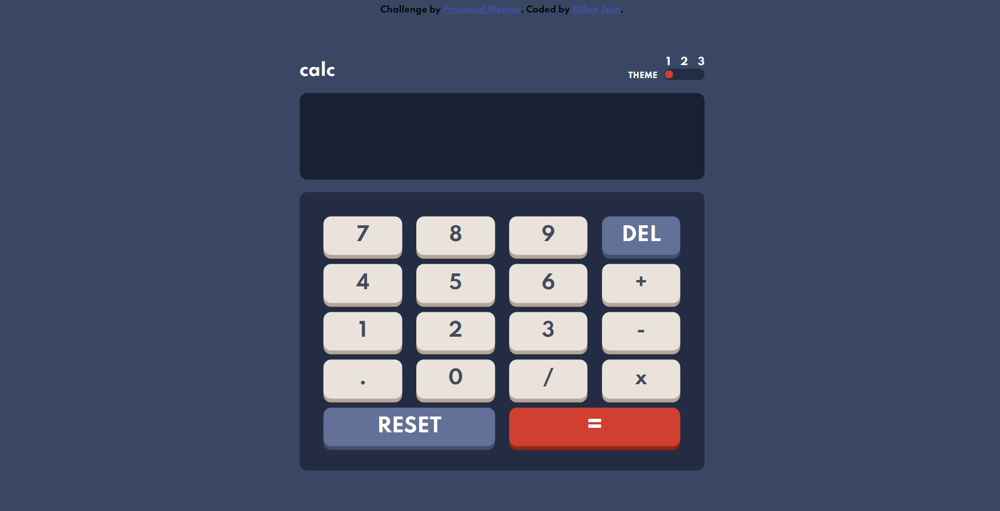

# Frontend Mentor - Calculator app

This is a solution to the [Calculator app challenge on Frontend Mentor](https://www.frontendmentor.io/challenges/calculator-app-9lteq5N29). Frontend Mentor challenges help you improve your coding skills by building realistic projects. 

## Table of contents

- [Overview](#overview)
  - [The challenge](#the-challenge)
  - [Screenshot](#screenshot)
  - [Links](#links)
- [My process](#my-process)
  - [Built with](#built-with)
  - [What I learned](#what-i-learned)
  - [Continued development](#continued-development)
  - [Useful resources](#useful-resources)
- [Author](#author)

### The challenge

Users should be able to:

- See the size of the elements adjust based on their device's screen size
- Perform mathmatical operations like addition, subtraction, multiplication, and division
- Adjust the color theme based on their preference
- **Bonus**: Have their initial theme preference checked using `prefers-color-scheme` and have any additional changes saved in the browser

### Screenshot

### Links

- Solution URL: [Add solution URL here](https://your-solution-url.com)
- Live Site URL: [Add live site URL here](https://your-live-site-url.com)

### Built with

- HTML5, CSS, Vanilla Javascript
- CSS custom properties
- Flexbox
- CSS Grid
- Mobile-first workflow

### What I learned

Learned about css grid(used flexbox previously), css custom properties(variables) for making different themes,event capturing and bubbling in javascript. 

### Continued development

In the future projects I will be focusing more on layouts(using grids,flexbox etc) as I dont feel completely comfortable and ended up having many nested divs. I will probably use frameworks like reactjs etc.

### Useful resources

- [resource 1](https://stackoverflow.com/questions/4616694/what-is-event-bubbling-and-capturing) - I was facing an issue and then I learnt about event bubbling and capturing from this top rated answer of stackoverflow.
- [resource 2](https://medium.com/@haxzie/dark-and-light-theme-switcher-using-css-variables-and-pure-javascript-zocada-dd0059d72fa2) - This is an amazing article which helped me in making different themes with css(and js).

## Author

- Website - [Milan Jain](https://www.your-site.com)
- Frontend Mentor - [@milanjain2208](https://www.frontendmentor.io/profile/milanjain2208)
- Twitter - [@milanjain22Jain](https://www.twitter.com/yourusername)